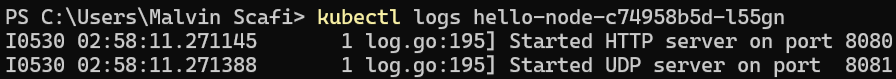
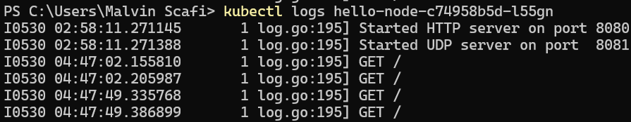
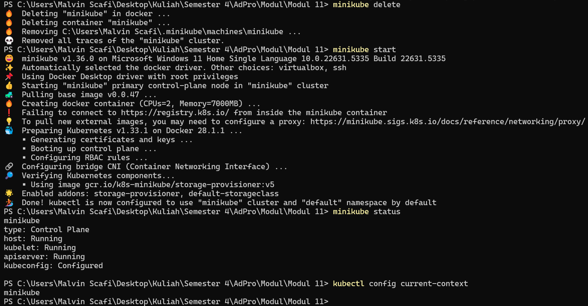
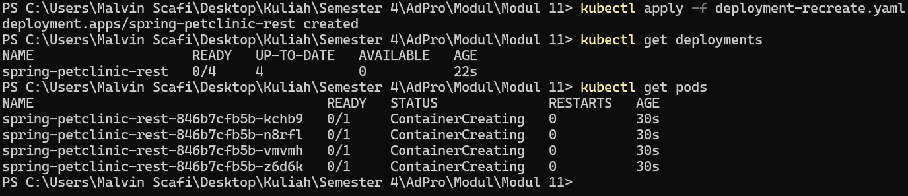
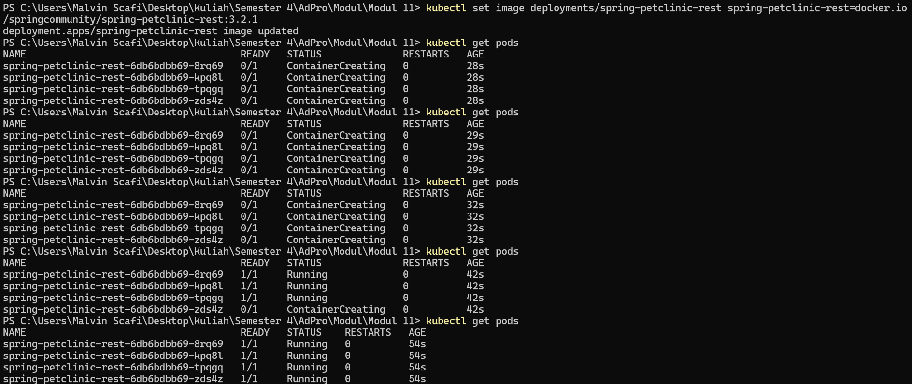
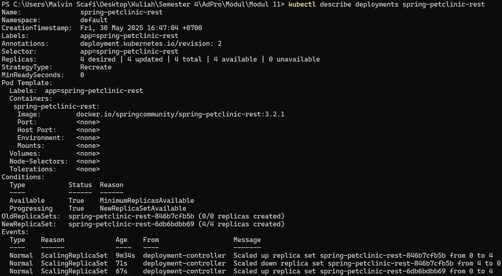

# Kubernetes Tutorial
**Nama:**   Malvin Scafi<br>
**NPM:**    2306152430<br>
**Kelas:**  AdPro A<br>

## Modul 11
### Reflection on Hello Minikube
1. **Compare the application logs before and after you exposed it as a Service. Try to open the app several times while the proxy into the Service is running. What do you see in the logs? Does the number of logs increase each time you open the app?**
- Sebelum ter-expose *service* : 

- Setelah ter-expose *service* : 

- Benar, jumlah log mengalami peningkatan setiap kali aplikasi diakses. Hal ini terjadi karena setiap permintaan HTTP yang masuk akan menghasilkan entri log baru yang terakumulasi berdasarkan frekuensi akses aplikasi. Sebelum pod di-expose sebagai service, tidak ada log yang tercatat karena pod tersebut masih terisolasi di dalam cluster dan tidak dapat dijangkau dari luar. Setelah pod ter-expose melalui service, barulah aplikasi dapat menerima traffic dari client eksternal, sehingga mulai muncul log aktivitas.

2. **Notice that there are two versions of `kubectl get` invocation during this tutorial section. The first does not have any option, while the latter has `-n` option with value set to `kube-system`. What is the purpose of the `-n` option and why did the output not list the pods/services that you explicitly created?**
- Opsi `-n` dalam perintah `kubectl get` berfungsi untuk menentukan namespace Kubernetes yang spesifik. Namespace adalah cara untuk mengelompokkan resources dalam cluster. Ketika `kubectl get` dijalankan tanpa `-n`, secara default akan menampilkan resources dari namespace `default`. Sebaliknya, `-n kube-system` menampilkan resources di namespace `kube-system` yang berisi komponen sistem Kubernetes seperti kube-proxy, coredns, dan control plane.
- Pods dan services yang dibuat berada di namespace `default`, sementara `kubectl get -n kube-system` hanya menampilkan resources di namespace `kube-system`. Kedua perintah melihat "ruang" yang berbeda dalam cluster yang sama, sehingga menghasilkan output yang berbeda sesuai isi masing-masing namespace.


### Reflection on Rolling Update & Kubernetes Manifest File
1. **What is the difference between Rolling Update and Recreate deployment strategy?**
- **Rolling Update**: Strategi deployment yang memperbarui pods secara bertahap. Pods lama akan dihentikan satu per satu sambil pods baru dibuat secara bersamaan, sehingga aplikasi tetap tersedia selama proses update. Strategi ini memastikan zero downtime dan memungkinkan rollback jika terjadi masalah.
- **Recreate**: Strategi deployment yang menghentikan semua pods lama terlebih dahulu, kemudian membuat pods baru dengan versi terbaru. Strategi ini menyebabkan downtime selama proses deployment karena tidak ada pods yang berjalan sementara waktu, namun lebih sederhana dan cocok untuk aplikasi yang tidak memerlukan high availability.

2. **Try deploying the Spring Petclinic REST using Recreate deployment strategy and document your attempt.**

- Megganti file `deployment.yaml` di beberapa bagian dan disimpan menjadi file baru `deployment-recreate.yaml` :
    ```yaml
    # Sebelum
    strategy:
        rollingUpdate:
        maxSurge: 25%
        maxUnavailable: 25%
        type: RollingUpdate
    # Sesudah
    strategy:
        type: Recreate

    # Sebelum
        deployment.kubernetes.io/revision: "4"
    # Sesudah
        deployment.kubernetes.io/revision: "5"

    # Sebelum
          - image: docker.io/springcommunity/spring-petclinic-rest:3.2.1
    # Sesudah
          - image: docker.io/springcommunity/spring-petclinic-rest:3.0.3
    ```

- Menjalankan Sesi Baru untuk Minikube


- Deploy Menggunakan Konfigurasi Baru `deployment-recreate.yaml`


- Upgrade Deployment


    Hasil monitoring menunjukkan bahwa strategi Recreate menyebabkan terminasi simultan semua pods existing saat update dimulai, mengakibatkan downtime aplikasi hingga pods baru selesai dibuat dan siap melayani request.

3. **Prepare different manifest files for executing Recreate deployment strategy.**
- File baru untuk mengeksekusi deployment sebelumnya dapat diakses di [sini](deployment-recreate.yaml).

4. **What do you think are the benefits of using Kubernetes manifest files? Recall your experience in deploying the app manually and compare it to your experience when deploying the same app by applying the manifest files (i.e., invoking `kubectl apply -f` command) to the cluster.**
- Berdasarkan pengalaman deployment, manifest file memberikan kemudahan signifikan dibandingkan eksekusi manual. Dengan menggunakan `kubectl apply -f`, seluruh proses deployment dapat diselesaikan dalam satu command, berbeda dengan pendekatan manual yang membutuhkan rangkaian perintah terpisah seperti `kubectl create`, `kubectl expose`, dan `kubectl scale`. Hal ini tidak hanya menghemat waktu tetapi juga meminimalkan risiko kesalahan operasional.

- Manifest file juga menjamin standardisasi konfigurasi deployment. Setiap anggota tim dapat menggunakan file yang sama untuk menghasilkan deployment identik, menghilangkan variasi yang mungkin terjadi akibat perbedaan parameter saat eksekusi manual. File ini dapat disimpan dalam version control, memungkinkan pelacakan perubahan dan memfasilitasi kolaborasi tim dalam mengelola infrastruktur aplikasi secara deklaratif.